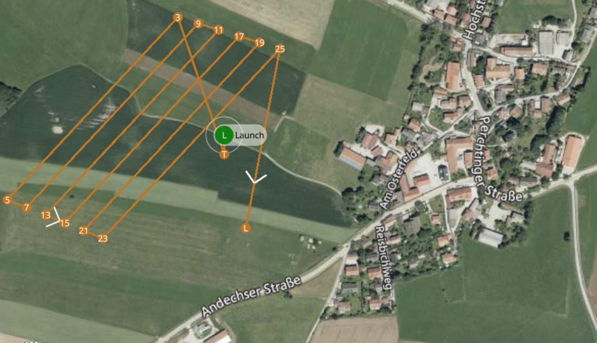

# Airfields for flight experiments

Official airfields. Are not used, because flying is allowed everywhere. But for presentations possibly suitable.

## Unering
Linderbergweg 1, 82229 Seefeld, Germany
Konstantin Kondak knows the mayor who gave his approval here.

[Maps: Digitale Plattform Unbemannte Luftfahrt](https://maptool-dpul-prod.dfs.de) or [ICAO Maps](https://secais.dfs.de/pilotservice/service/aup/aup_edit_map.jsp#contentMap) 

!!! danger "Airspace D"
    For entry into airspace D, it is mandatory to receive an entry permit by radio. Since airspace D begins here at GND, UAV flight is only possible under [NfL 2021-1-2248](https://www.baf.bund.de/SharedDocs/Downloads/DE/Publikationen_BAF/NfL/NfL_2021-1-2248_Flugmodelle-UAS.html;jsessionid=9ADBB9113A4E5A7EAF38D6E799588EF0.live11293?nn=1576512)