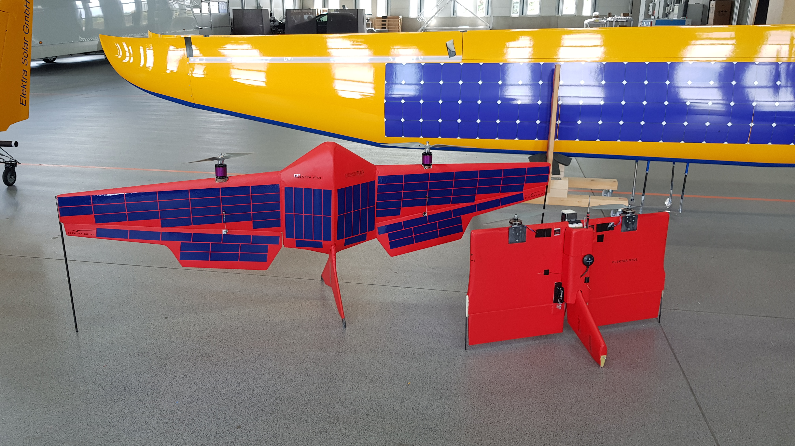

# Hardware

### WLAN settings 

!!! info "default settings"
    These settings were initially defined. Since many experiments run with a different setup, they are only to be considered as default.

Fritzbox:
IP-Adresse: 192.168.1.1
Subnetzmaske: 255.255.255.0
DHCP-Server: aktiviert
von: 192.168.1.20
bis: 192.168.1.200

static ip addresses
* DariosJet: 192.168.1.21
* Up: 192.168.1.22
* Sven-Rechner: 192.168.1.70
* Ubiquiti Rocket: 192.168.1.80
* Ubiquiti Bullet: 192.168.1.81

* Password (WLAN & GUI): ElektraSolar
* WLAN-SSID: iVTOL
* MyFRITZ!
    * berthold.baeuml@th-deg.de
    * ElektraSolar

## Elektra VTOL2 (red)

## Elektra VTOL (white)

