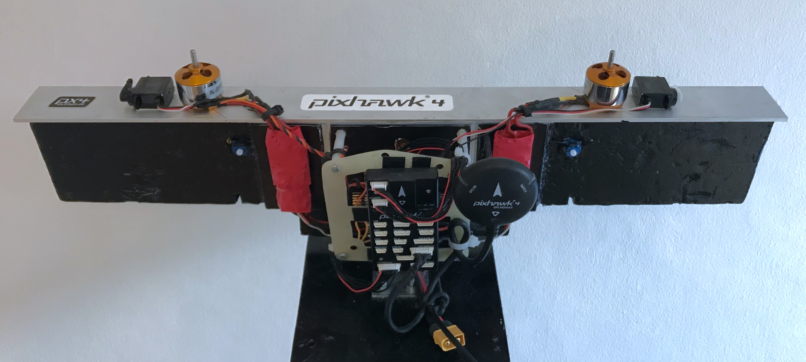
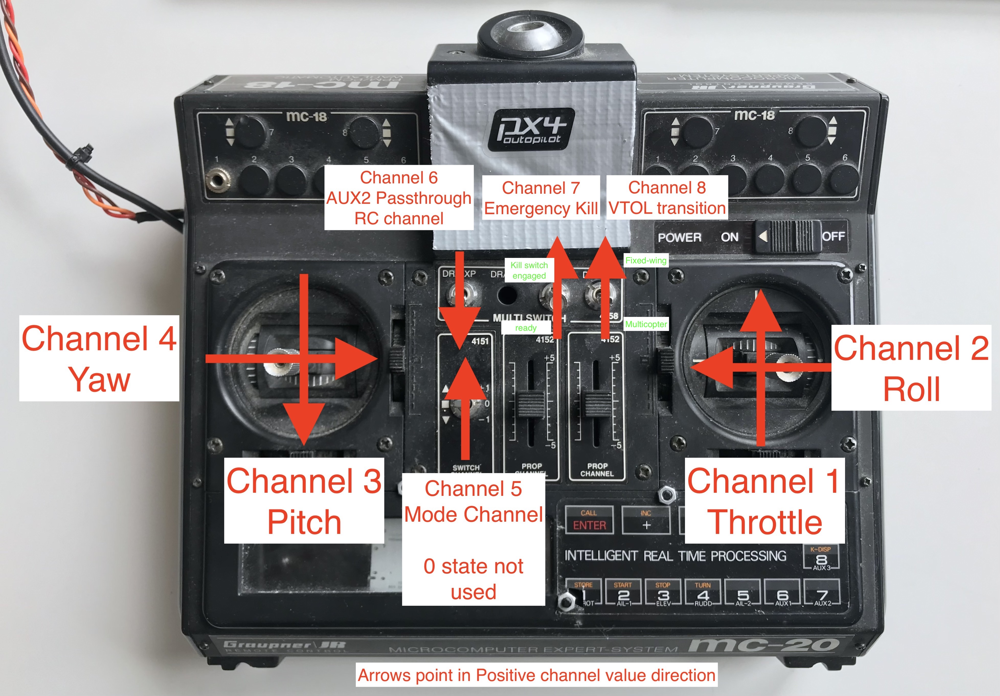

# IRON Bird

The Iron Bird can be used for hardware in the loop testing. It consists of a Pixhawk 4, a board for the power electronics, two motors, two servos, a GPS receiver and optionally a remote control and an UpBoard.




## Quickstart

1. Install the [PX4 Toolchain](https://docs.px4.io/master/en/dev_setup/dev_env.html)
1. Clone the [Elektra Solar PX4](https://bitbucket.org/elektrateam/px4-autopilot/src/67d2dec0b7f8d6c63148a57e254deb9cc76c9094/?at=feature%2Fext_control) (Version 1.11). For external control use branch **feature/ext_control**. 
```
$ git clone git@bitbucket.org:elektrateam/px4-autopilot.git --recursive
```

3. Manually use the correct commit hash to check out the submodules in the appropriate version (detached head). The commit hashes are displayed in the repro. Special care with the Sub-Submodule PX4-OpticalFlow in the Sumbodule PX4-SITL_gazebo. 
- update submodule **libuavcan** with 
```
$ git submodule update --init
```
4. Try to [Build the code](https://docs.px4.io/master/en/dev_setup/building_px4.html)
```
$ make px4_sitl gazebo
```
5. Install [QGroundControl](http://qgroundcontrol.com) (Linux: You can add a [Launcher](https://askubuntu.com/questions/67753/how-do-i-add-an-application-to-the-dash) to start the AppImage from the dash)
6. Connect the IRON Bird via Micro USB to the QGroundControl computer. 

7. QGroundControl should detect the Pixhawk 4 directly.


8. Load the [parameter file](../assets/vtol/iron_bird/iron_bird.params) inorder to use QGroundcontrol via USB while arming (e.g. sets parameter CBRK_USB_CHK to 197848 )


## Remote Control
The remote control can be connected directly to the PPM RC connector on the Pixhawk 4. In addition, a power supply via USB is required.


- Arming the Drone with the RC use the [Arming Gesture](https://docs.px4.io/master/en/advanced_config/prearm_arm_disarm.html#arming-gesture).


