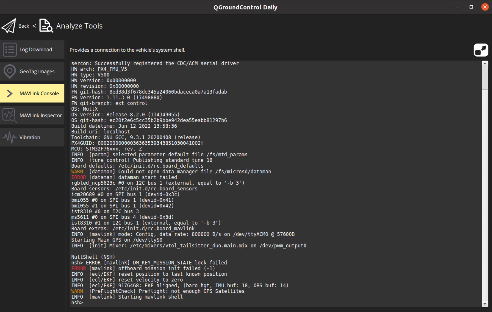

# PX4 External Controll Modifications

To use PX4 as a fallback option and as an interface to the hardware, a minimal interface was built in which accesses the corresponding parts via a serial interface.


[Pixhawk 4 Serial Port Mapping](https://docs.px4.io/master/en/flight_controller/pixhawk4.html)


[good Serial comunication example (Linux)](https://blog.mbedded.ninja/programming/operating-systems/linux/linux-serial-ports-using-c-cpp/)


## Building firmware

First try to build the firmware with

```
$ cd px4-autopilot
$ make px4_fmu-v5_default
```

Than build and flash the firmware

```
$ make px4_fmu-v5_default upload
```

If you want to update the firmware of the second IO chip you have to rebuild everything.

```
$ make clear
$ make px4_fmu-v5_default upload
```

## PX4 Consoles/Shells (Useful for debugging)

The [PX4 Console](https://docs.px4.io/master/en/debug/consoles.html#using-consoles-shells) can be reached through QGroundControl. 

QGroundControl -> Analyze Tools -> MAVLink Console


Test if the actuator_ext_control topic is running
```
nsh> uorb top -1 actuator_ext_control 
```

```
nsh> listener actuator_ext_control
```

Use ``` PX4_INFO("Some info..."); ``` or ``` PX4_ERR("Print int (%i)", int) ``` in the PX4 code running on the FMU to output messages. The messages can also be read via the MAVLink console with the ```nsh> dmesg ``` command.




## Pixhawk 4 (hardware) & PX4 (software)
The Pixhawk 4 is a working flight controller. We use it as a fallback option to have a working drone as a starting point. At the same time, there is a lot of uncommented, and difficult to understand code.


### Our customization

The working branch on the [elektra-solar Bitbucket](bitbucket.org/elektrateam/px4-autopilot.git) is ext_control.


### Two processors

The [Pixhawk4](https://docs.px4.io/master/en/hardware/reference_design.html) has two processors. The FMU (Flight management unit) and the IO (Input Output) processor. The actuators are normally driven by the IO processor. 

!!! info "AUX PWM usage"
    We operate the actuators at the "AUX" PWM outputs which are directly driven by the FMU.


Theoretically, in order to output external PWM signals via the IO processor, the data would have to be routed as follows: **This procedure have not been tested. It is only a guess.**
1. Data arrive at the FMU via a serial interface (in our case UART2 / TELEM1).
2. An customized module (in our case ext_control) accepts the serial communication and writes the PWM values into a uORB topic (in our case actuator_ext_control.msg).
3. The px4io driver subscribes to the topic and generates a suitable serial message from it.
4. The message is sent from the FMU to the IO processor via the serial interface (UART8).

The IO processor runs its own firmware which can be found in the PX4 repository under src/modules/px4iofirmware. Even if the firmware is located at the modules folder it is NOT a module! It can not access the uORB messages. The whole communication on the IO processor runs over register.

5. px4iofirmware/serial.c accepts the communication and stores the corresponding PWM message in an extra register. The register must previously be defined in px4iofirmware/registers.c.
6. px4iofirmware/mixer.cpp must now detect whether the external PWM signals are to be used (Best via a flag which has to be defined in px4iofirmware/protocol.h) and then pass them to the function up_pwm_servo_set(). Furthermore all other calls of this function must be suppressed.


!!! info "IO chip latency"
    The IO chip (MAIN pins) adds about 5.4 ms latency compared to using the AUX pins (this does not apply to a Pixracer or Omnibus F4, but does apply to a Pixhawk). To avoid the IO delay, disable SYS_USE_IO and attach the motors to the AUX pins instead. [source](https://docs.px4.io/master/en/config_mc/filter_tuning.html#control-latency)\
    \
    For the Electra Solar parameter file:\
    SYS_USE_IO: IO PWM Disable\ 
    TRIG_MODE: Disable 


