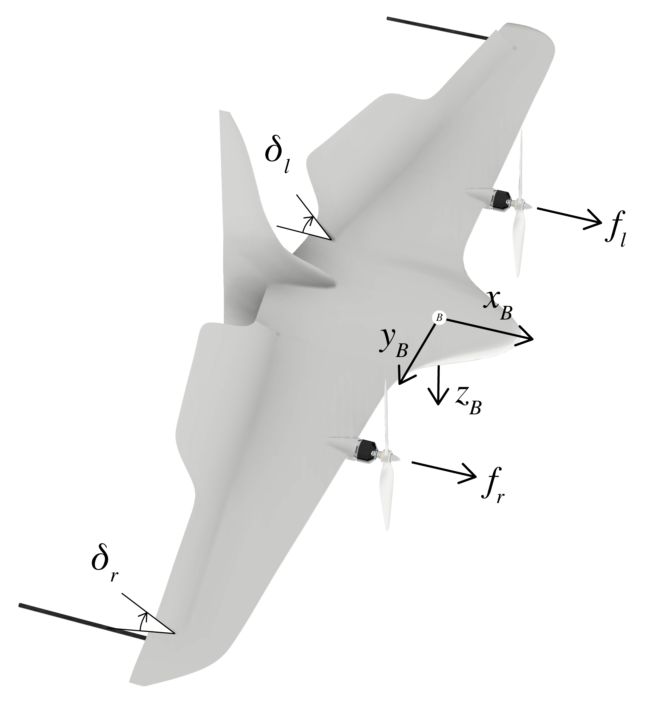

## Elektra VTOL3 (Brett)

| Mass    | Height | Wingspan | Flap height | Flap width | Actuators       | Thrust |
|---------|--------|----------|-------------|------------|-----------------|--------|
| 2.285 kg | 0.48 m | 0.9 m    | 0.135 m     | 0.42 m     | 2 Servo, 2 BLDC | 4 kg   |

The following data was obtained by bifilar pendulum testing on 02.10.2022.
Rotation damping torque $\tau_d$ depending on the angular velocity $ω$.

Damping calculation: $\tau_d = sign(ω) * (ω^2) * Damping$

| Axis        | Inertia   | Damping    |
|-------------|-----------|------------|
| X           | 0.09841   | 0.00957    |
| Y           | 0.04561   | 0.01616    |
| Z           | 0.07320   | 0.03822    |

|   |   | 
|-------------|-------------|
|    |           |   
|    |         |   

!!! danger "e-ID Drohne"
    Auf der VTOL 3 Drohne (Brett) ist keine e-ID, sondern eine persönliche Identifikationsnummer eines EU-Kompetenznachweises für Fernpiloten angebracht (vermutlich von sven.schmid@elektra-uas.de)! Die e-ID hat ivian.kuscheff@th-deg.de. Diese sollte irgendwann auch auf der Drohne angebracht werden.

## Hardware components

### RFD868x
Used to send telemetry data to QGroundControl.

Can also be used to operate the UART communication wirelessly. e.g. if you do not want to execute the calculation on the UpBoard but on another computer.
[RFD900x_Peer-to-peer_V3_User_Manual_V1.3.pdf](../assets/hardware/RFD900x_Peer-to-peer_V3_User_Manual_V1.3.pdf)
To configure the radio bridge there is a software tool (Windows). QGroundControl works with the factory settings

### Propeller 13x4.7SF

[APC Propellers](https://www.apcprop.com/product/13x4-7sf/)

|                     | inches    | mm         |
|---------------------|-----------|------------|
| Pitch               | 4.7       | 119.38     |
| Propeller Diameter  | 13        | 330.2      |

[Propeller_13x47SF.dat](../assets/hardware/Propeller_13x47SF.dat.txt)

### Electronic speed control - ESC

DJI 3S - 4S LiPo 30A Opto Brushless ESC

!!! danger "calibration"
    These ESCs have an internal calibration. The hope is that both are calibrated the same. This is not known but there is nothing to indicate that it is not the case.

### Motor - Rctimer 5010 620KV

KV(rpm/v): 620

[rctimer](https://www.rctimer.com/rctimer-5010-260kv-multirotor-brushless-motor40mm-shaft-p0132.html)