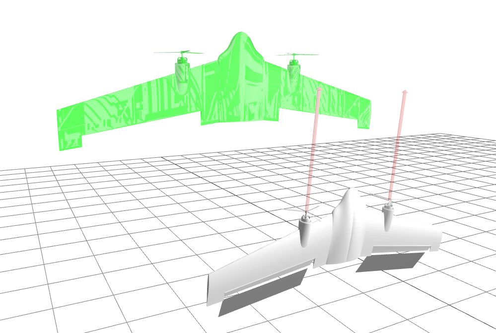

# Visualization
The visualization is provided by [MeshCat](https://github.com/rdeits/meshcat). [MeshCat](https://github.com/rdeits/meshcat) is a remotely-controllable 3D viewer, built on top of [three.js](https://threejs.org). he MeshCat viewer runs in a browser and listens for geometry commands over WebSockets. This makes it easy to create a tree of objects and transformations by sending the appropriate commands over the websocket.

[Julia bindings](https://github.com/rdeits/MeshCat.jl) to the MeshCat WebGL viewer are still very basic but work for the most necessary applications. [API Reference](https://docs.juliahub.com/MeshCat/CZdjb/0.14.2/)

The [three.js](https://threejs.org) webpage offers lots of examples and usefull tools like [MeshPhongMaterial](https://threejs.org/docs/index.html?q=mesh#api/en/materials/MeshPhongMaterial) where you can test the appearance of different materials.

The visualisation can be used to display e.g. the current position, orientation, flap position, propeller thrust as well as a target position in the web browser [http://localhost:8701](http://localhost:8701).

 

## Functions
```@autodocs
Modules = [Visualization]
Order   = [:function, :type]
```