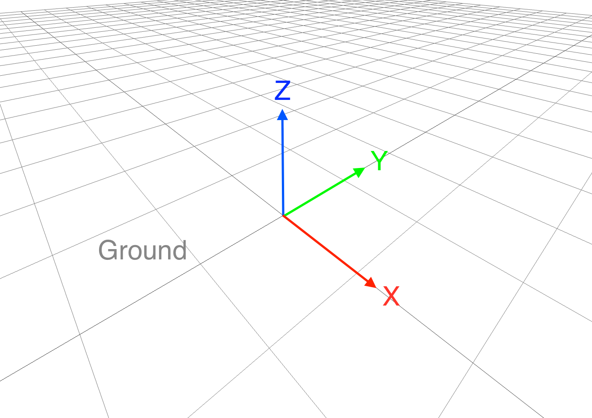

## Frame definition

|   |   | 
|-------------|-------------|
|    |           |   
|    |        |
|    |       |


!!! info "Body Frame"
    Body always refers to the CoM. Not the position of the IMU, the GPS or the aerodynamic pressure point.


## Functions
```@docs
VtolModel.vtol_model(v_B, actions, param)
VtolModel.aerodynamic_torque_model(v_B, actions, angle_of_attack, airspeed, param)
VtolModel.propeller_torque_model(actions, param)
VtolModel.aerodynamic_force_model(actions, aoa, airspeed, param)
VtolModel.aerodynamic_force_model_wing_surface(actions, aoa, airspeed, param, lateral_airspeed)
VtolModel.propeller_force_model(actions)
```
